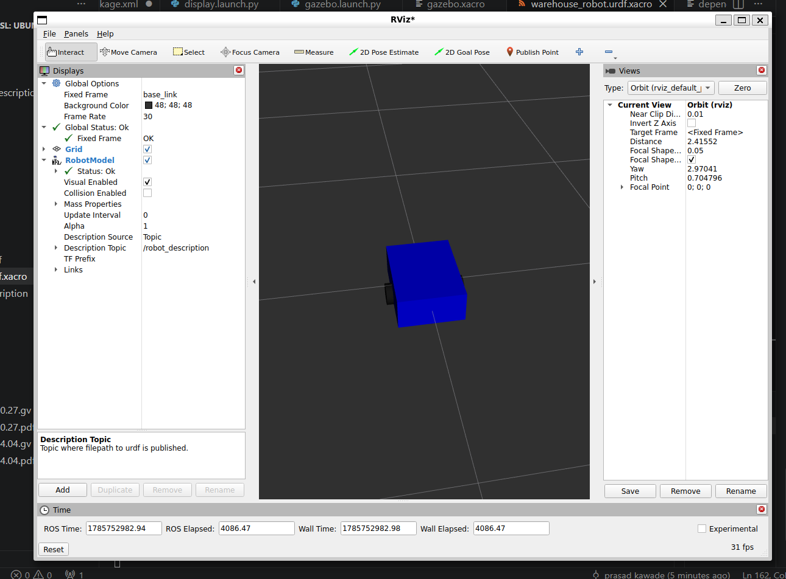
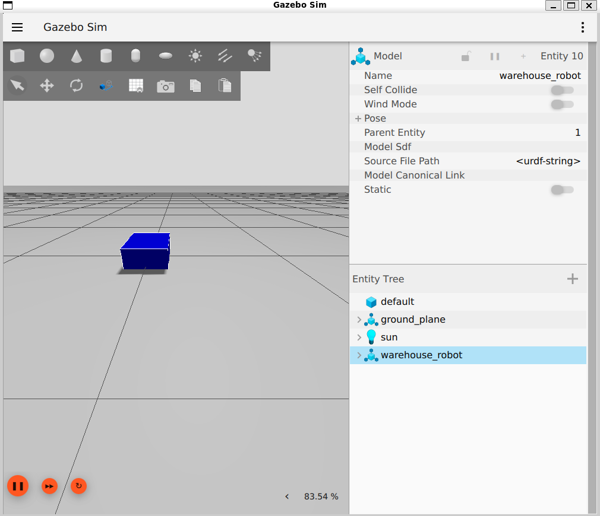

# 🤖 Warehouse Robot Simulation using ROS 2 Jazzy & Gazebo Harmonic

A custom Differential Drive Autonomous Mobile Robot (AMR) built completely from scratch using **ROS 2 Jazzy**, **Gazebo Harmonic**, **RViz2**, and **Xacro**.

This project demonstrates robot modeling, simulation, differential drive control, keyboard teleoperation, LiDAR integration, and ROS ↔ Gazebo communication. It serves as the foundation for building a fully autonomous warehouse robot using **SLAM Toolbox** and **Navigation2**.

---

# 🚀 Project Overview

This project aims to build a complete Autonomous Mobile Robot (AMR) for warehouse automation.

The robot is being developed incrementally, with each milestone introducing a new robotics capability.

Current development includes:

- ✅ Robot Modeling
- ✅ Gazebo Simulation
- ✅ Differential Drive
- ✅ Keyboard Teleoperation
- ✅ 2D LiDAR
- ✅ LaserScan Publishing

Upcoming milestones include:

- Camera Integration
- SLAM Mapping
- Navigation2
- Warehouse Environment
- Autonomous Navigation
- Pick & Place

---

# 📈 Project Progress

| Milestone | Status |
|-----------|--------|
| Milestone 1 – Robot Description | ✅ Complete |
| Milestone 2 – Gazebo Integration | ✅ Complete |
| Milestone 3 – Differential Drive & Teleoperation | ✅ Complete |
| Milestone 4 – 2D LiDAR Integration | ✅ Complete |
| Milestone 5 – Camera Integration | ⏳ In Progress |
| Milestone 6 – SLAM Mapping | ⏳ Planned |
| Milestone 7 – Navigation2 | ⏳ Planned |
| Milestone 8 – Autonomous Navigation | ⏳ Planned |

---

# 🛠️ Technologies Used

- ROS 2 Jazzy
- Gazebo Harmonic
- RViz2
- URDF
- Xacro
- Python Launch Files
- Robot State Publisher
- Joint State Publisher
- ros_gz_sim
- ros_gz_bridge
- Differential Drive Plugin
- Gazebo Sensors System
- LaserScan
- Git
- GitHub

---

# 📂 Project Structure

```text
warehouse_robot_ws
│
├── src
│   └── warehouse_robot_description
│       ├── launch
│       ├── resource
│       ├── test
│       ├── urdf
│       ├── package.xml
│       ├── setup.py
│       └── setup.cfg
│
├── build
├── install
├── log
├── images
└── README.md
```

---

# ✅ Completed Milestones

## ✅ Milestone 1 – Robot Description

- Created ROS 2 workspace
- Built custom robot description package
- Designed robot using URDF & Xacro
- Visualized robot in RViz2
- Configured Robot State Publisher
- Configured Joint State Publisher

---

## ✅ Milestone 2 – Gazebo Integration

- Spawned custom robot in Gazebo Harmonic
- Created Gazebo launch file
- Verified robot model
- Fixed spawning and physics issues

---

## ✅ Milestone 3 – Differential Drive & Keyboard Teleoperation

- Configured Differential Drive plugin
- Added Gazebo physics
- Connected `/cmd_vel`
- Integrated `ros_gz_bridge`
- Controlled robot using Keyboard Teleoperation

---

## ✅ Milestone 4 – 2D LiDAR Integration

- Added custom LiDAR link
- Mounted LiDAR on robot
- Configured Gazebo Sensors System
- Added GPU LiDAR sensor
- Published `/scan`
- Bridged LaserScan to ROS 2
- Verified LiDAR data using `ros2 topic echo`

---

## ✅ Milestone 5 – RGB Camera Integration

- Added RGB camera to the robot
- Mounted camera on the front of the robot
- Configured Gazebo Harmonic camera sensor
- Published `/camera` image topic
- Published `/camera_info`
- Bridged camera data to ROS 2
- Verified live camera stream

---

# 📸 Current Simulation

## RViz2 Visualization

<p align="center">
  
</p>

---

## Gazebo Harmonic Simulation

<p align="center">
  
</p>

---

### Current Features

- ✅ Differential Drive
- ✅ Keyboard Teleoperation
- ✅ 2D LiDAR
- ✅ RGB Camera
- ✅ LaserScan Publishing
- ✅ Camera Image Streaming
- ✅ ROS ↔ Gazebo Bridge
- ✅ Gazebo Harmonic Simulation
- ✅ RViz2 Visualization

---

# 🚀 Build

```bash
cd ~/warehouse_robot_ws

colcon build --symlink-install
```

---

# ▶️ Run Simulation

```bash
source /opt/ros/jazzy/setup.bash

source install/setup.bash

ros2 launch warehouse_robot_description gazebo.launch.py
```

---

# 🎮 Keyboard Teleoperation

Open another terminal

```bash
source /opt/ros/jazzy/setup.bash

source install/setup.bash

ros2 run teleop_twist_keyboard teleop_twist_keyboard
```

---

# 🌉 ROS ↔ Gazebo Bridge (Velocity Commands)

Open another terminal

```bash
source /opt/ros/jazzy/setup.bash

source install/setup.bash

ros2 run ros_gz_bridge parameter_bridge \
/cmd_vel@geometry_msgs/msg/Twist@gz.msgs.Twist
```

---

# 📡 ROS ↔ Gazebo Bridge (LiDAR)

Open another terminal

```bash
source /opt/ros/jazzy/setup.bash

source install/setup.bash

ros2 run ros_gz_bridge parameter_bridge \
/scan@sensor_msgs/msg/LaserScan@gz.msgs.LaserScan
```

---

# ✅ Verify Topics

Check available ROS topics:

```bash
ros2 topic list
```

Expected topics include:

- `/cmd_vel`
- `/odom`
- `/scan`
- `/tf`

Verify LiDAR:

```bash
ros2 topic echo /scan
```

---

# 🗺️ Roadmap

- ✅ Robot Description
- ✅ Gazebo Simulation
- ✅ Differential Drive
- ✅ Keyboard Teleoperation
- ✅ LiDAR Integration
- ✅ Camera Integration
- ⏳ SLAM Mapping
- ⏳ Navigation2
- ⏳ Warehouse Environment
- ⏳ Autonomous Navigation
- ⏳ Pick & Place

---

# 📚 Learning Objectives

This project demonstrates practical experience with:

- Robot Modeling
- ROS 2
- URDF
- Xacro
- Gazebo Harmonic
- Differential Drive Kinematics
- Robot State Publisher
- TF Tree
- ROS ↔ Gazebo Communication
- LaserScan Sensors
- Robot Teleoperation
- Git & GitHub

---

# 👨‍💻 Author

**Prasad Kawade**

Automation & Robotics Engineer

GitHub: https://github.com/Prasadkawade21

LinkedIn: www.linkedin.com/in/prasad-kawade

---

# ⭐ Future Work

## Upcoming Milestones

- SLAM Toolbox Mapping
- AMCL Localization
- Navigation2 Integration
- Warehouse Environment Simulation
- Autonomous Obstacle Avoidance
- Goal-Based Navigation

## Future Enhancements

- Pick & Place Integration
- Multi-Robot Fleet Simulation
- Web Dashboard for Robot Monitoring
- Object Detection using RGB Camera (YOLO/OpenCV)

---

# 📄 License

This project is licensed under the MIT License.